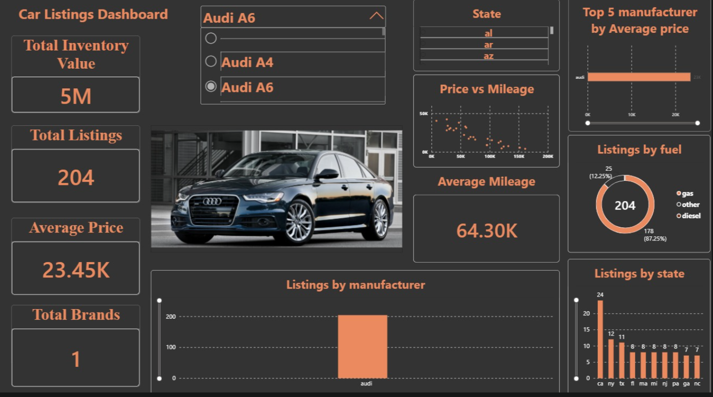
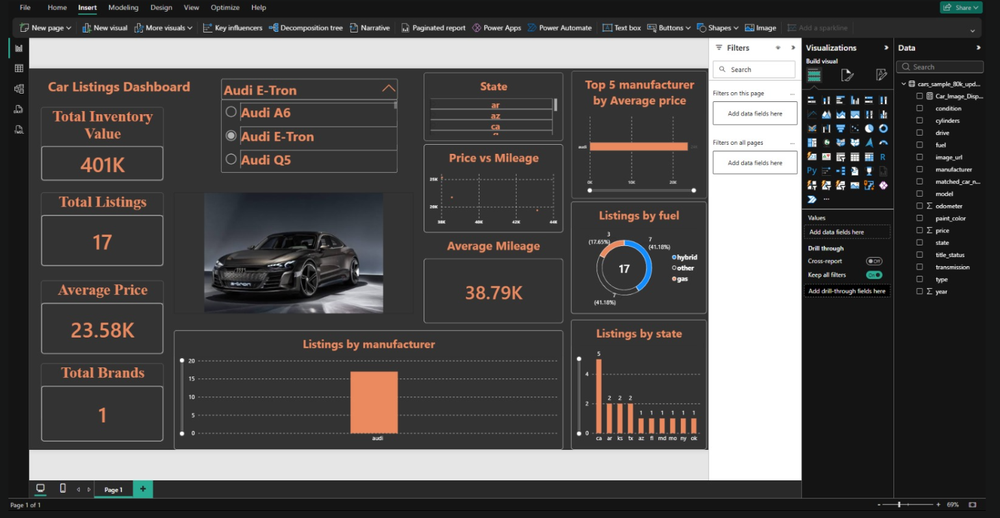
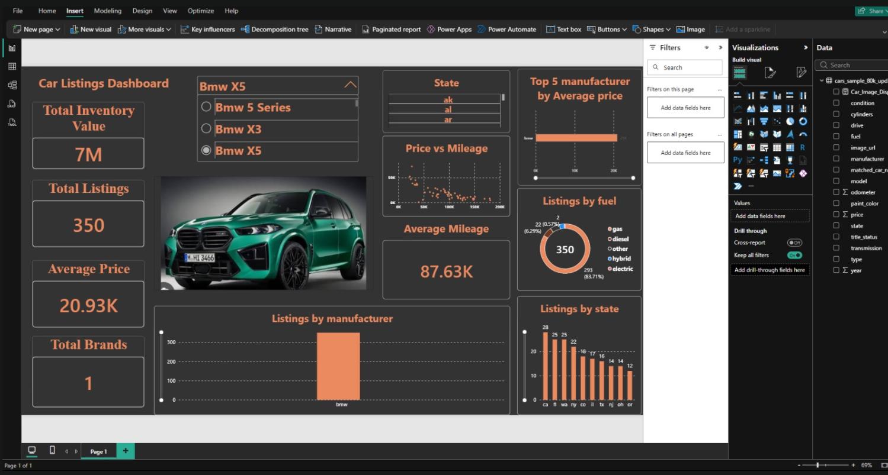
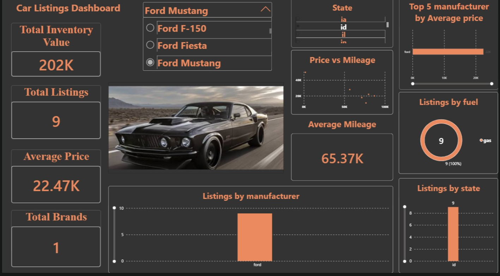
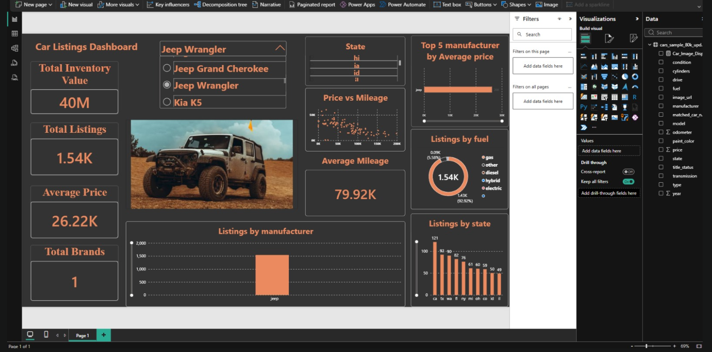
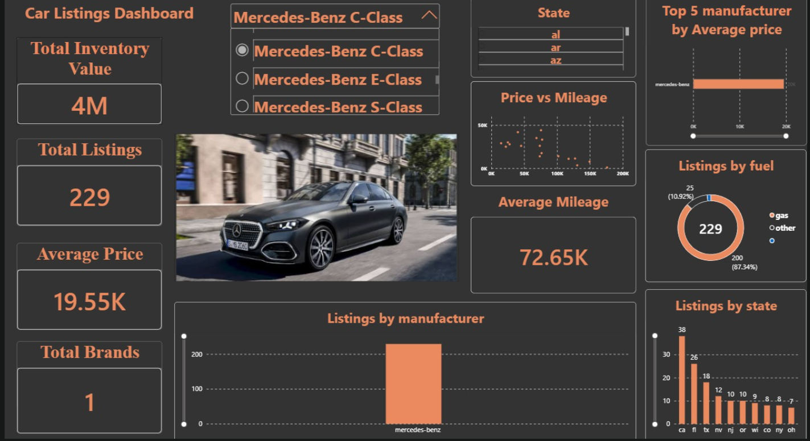
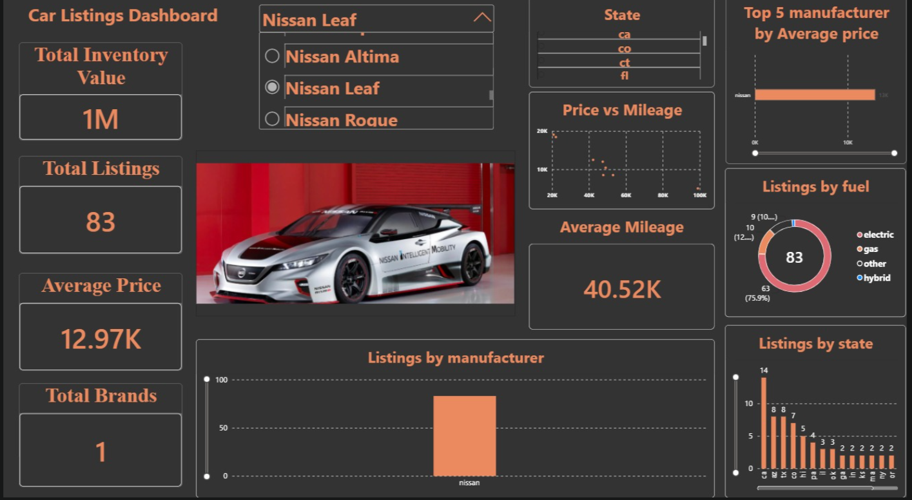
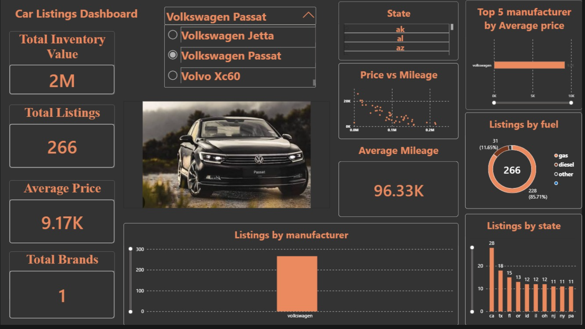
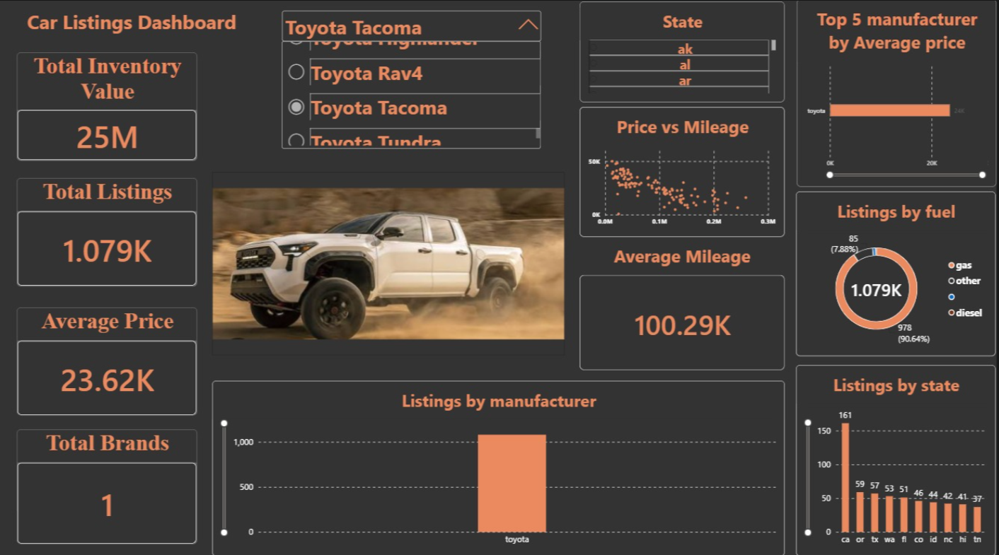
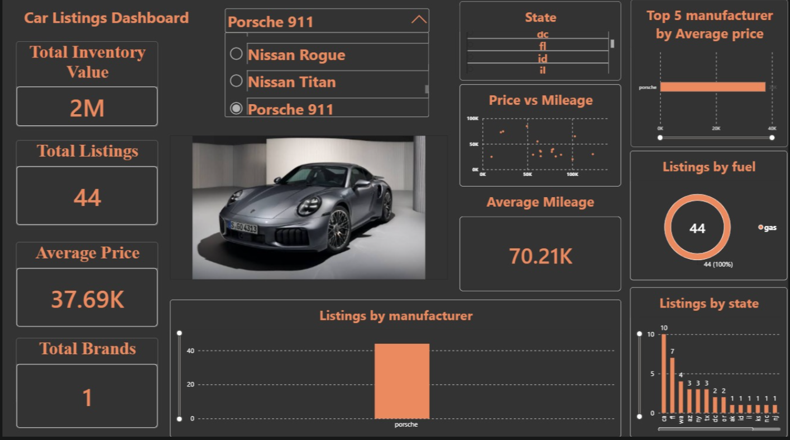

<div align="center">

#  Used Car Market Analysis Dashboard


*An end-to-end interactive Power BI dashboard analyzing 80k+ US car listings, pricing dynamics, mileage correlations, and inventory distribution with dynamic car rendering.*

---

</div>

## 📌 Executive Overview

This repository contains a full-stack **Car Listings Market Analysis Project**. Powered by custom Python ETL pipelines (`clean_data.py` & `download_images.py`) and an interactive Power BI interface, this dashboard allows automotive analysts to explore model-specific market metrics, depreciation curves, and geographic inventory density.

---

## ✨ Key Features

- **🏎️ Dynamic Vehicle Image Display:** Automatically renders high-resolution model images (from a curated set of 80 vehicle images) based on user selections.
- **📊 Real-time Cross-Filtering:** Interactive scatter plots, donut charts, bar charts, and KPI cards respond seamlessly to model and state slicers.
- **💡 Key Performance Indicators (KPIs):** Instant calculation of Total Inventory Value, Total Listings Count, Average Price, Average Mileage, and Brand Counts.
- **📉 Price vs. Mileage Depreciation:** Visualizing odometer impact on vehicle pricing using interactive scatter plots.
- **⚡ Fuel & Geographic Segmentation:** Comprehensive breakdown across Gas, Diesel, Electric, and Hybrid variants across US states.
- **🎨 Dark Theme Executive UI:** Tailored with high visual hierarchy and contrast for presentation-ready analysis.

---

## 📊 Dashboard Previews

Here are sample screenshots showcasing dynamic filtering, price vs. mileage distribution, and inventory metrics across different car models:

| Audi A6 | Audi E-Tron |
| :---: | :---: |
|  |  |

| BMW X5 | Ford Mustang |
| :---: | :---: |
|  |  |

| Jeep Wrangler | Mercedes-Benz C-Class |
| :---: | :---: |
|  |  |

| Nissan Leaf | Volkswagen Passat |
| :---: | :---: |
|  |  |

| Toyota Tacoma | Porsche 911 |
| :---: | :---: |
|  |  |

---

## 📈 Key Market Insights & Business Analytics

Based on the 80k+ vehicle listing dataset and cross-filtering analysis, key findings include:

- **💰 High Retention vs. Mass Market:** Luxury models like *Porsche 911* maintain an average price around **$37.69K** with gas orientation, whereas mass-market trucks like *Toyota Tacoma* represent massive inventory volumes (**$25M Total Inventory Value** across **1.079K listings**).
- **📉 Price vs. Mileage Depreciation:** The scatter plot analysis reveals a steep depreciation curve as vehicles cross the **50K–100K mileage threshold**, varying significantly by manufacturer reliability.
- **⚡ Regional & Fuel Distribution:** Alternative fuel variants (Hybrid/EV) like *Audi E-Tron* and *Nissan Leaf* show high inventory density in states with EV-friendly infrastructure like California (`ca`).

---

## ⚙️ Data Pipeline & Architecture

| Stage | Component / Tool | Inputs | Outputs | Description |
| :--- | :--- | :--- | :--- | :--- |
| **01. Data Preprocessing** | `clean_data.py` | Raw Dataset | Processed Data | Cleans data schema, handles missing values, and removes statistical outliers. |
| **02. Asset Acquisition** | `download_images.py` | Vehicle Models | `images/` (80 Assets) | Downloads 80 high-resolution vehicle images required for dynamic dashboard rendering. |
| **03. Data Modeling** | Power BI Engine | CSV & Images Folder | Data Model | Implements DAX measures, establishes data relationships, and configures bidirectional cross-filtering. |
| **04. Executive UI** | Power BI Dashboard | Integrated Model | Interactive UI | Renders end-user dashboard with real-time filters, scatter plots, and dynamic image rendering. |


---

## 📂 Repository Structure & Project Architecture

```text
Car-Dashboard/
├── 📂 dashboard/                     # Power BI reports & PDF exports
│   ├── 📊 Car_Dashboard_Dark_v3.pbix  # Final Production Dashboard
│   └── 📄 Car_Dashboard_Dark_v3.pdf   # High-resolution PDF export
├── 📂 data/                          # Cleaned & processed CSV datasets
├── 📂 images/                        # 80 High-res car images for dynamic UI
├── 📂 screenshots/                   # Preview screenshots (C1.png - C10.png)
├── 📂 scripts/                       # Automated Python ETL pipelines
│   ├── 🐍 clean_data.py              # Data cleaning & preprocessing
│   └── 🐍 download_images.py         # Automated vehicle image downloader
├── 🚫 .gitignore                     # Git system rules (excludes venv)
└── 📝 README.md                      # Project documentation & guidelines
```

---

## 📌 Summary of Key Deliverables

- **⚡ Automated Data Pipeline:** Fully reproducible data cleaning and outlier handling via `scripts/clean_data.py`
- **🖼️ Dynamic Asset Engine:** Automated scraper and dynamic DAX URL resolution for 80 high-res model images.
- **📊 Production Dashboard:** Interactive `.pbix` report optimized for dark-mode executive presentations.

---

<div align="center">

**Designed for Automotive Market Intelligence & Strategy**  
*If you find this analytical framework valuable, feel free to star ⭐ this repository!*

</div>